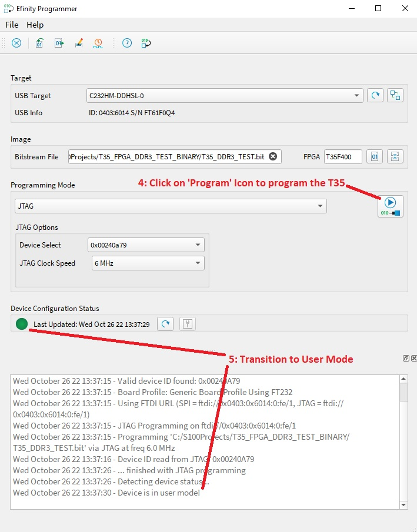
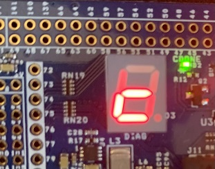
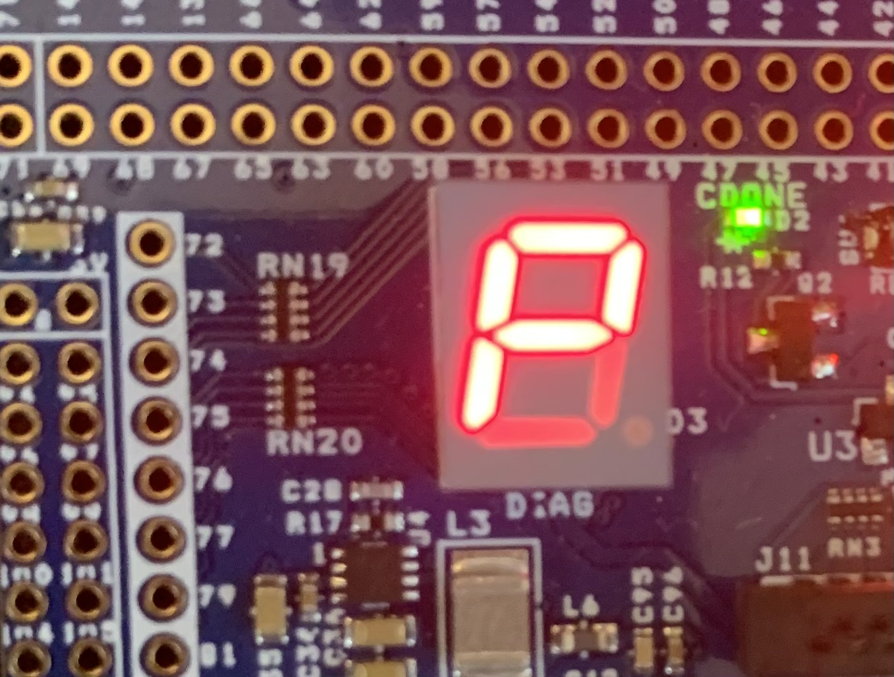
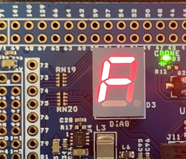

# T35_FPGA_DDR3_TEST_BINARY
DDR3 Test Project for S100computers.com T35 FPGA Module
Copyright 2022

## Description

The *T35 DDR3 Test Program* was initially written to test the DDR3 Interface on T35 FPGA Modules to guarantee functionality of the newly built modules.  It does this by:

  1. Performing a *DDR3 Interface Calibration Cycle*.
  2. Performing a *Write/Read Memory Test*.

The *DDR3 Interface Calibration Cycle* tests and measures the characteristic delays and timings of the interface and stores those values in the DDR Controller registers.  This process takes a couple of seconds and is necessary on each new power cycle.

The *Write/Read Memory Test* only tests the first 1 M-Byte of SDRAM, since this address arrangement exercises all the individual signals going to/from the DDR3 SDRAM.

If a T35 Module User has a Licensed Efinity Toolset from Efinity, I can provide the source to this project.  Please contact me if you have an interest.

## Instructions for use:
Copy the *T35_DDR3_TEST.bit* file to a dedicated directory on your PC.

Open the *Efinity 202x.x Programmer* in the <b>Efinity 202x.x</b> Folder.

1. Click the 'Open Image File' dialog box by clicking the *01* icon (next to the filenam box), navigate to the downloaded image, and 2. select the *T35_DDR3_TEST.bit* File.  3. Click 'Open'.

4. Click on the Program button ('Play->010>IC') Icon to program the T35 DDR3 Test Program to Configurration RAM.

5. Wait for completion of programming as shown by *Transition to User Mode*.

When the program initially starts, it goes into the *DDR3 Interface Calibration Cycle* as shown by a 'c' on the seven segment display:

After Calibration is complete, the *Write/Read Memory Test* runs and completes in only a few milliseconds due to the high-bandwidth 1,600 M-Bytes/second DDR Interface.  

### If the *Write/Read Memory Test* passes, it displays a 'P' on the seven segment display:

### If the *Write/Read Memory Test* fails, it displays an 'F' on the seven segment display:

