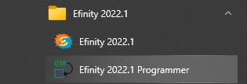
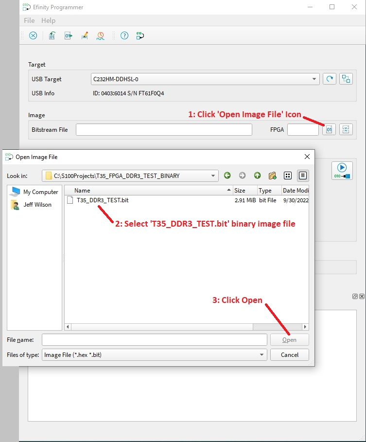

# T35_FPGA_DDR3_TEST_BINARY
DDR3 Test Project for S100computers.com T35 FPGA Module
Copyright 2022

## Instructions for use:
1. Copy the *T35_DDR3_TEST.bit* file to a dedicated directory on your PC.
2. Open the *Efinity Programmer* in the <b>Efinity Programmer</b> Folder.

3. Select the *Bitstream File* in the *Image* box by clicking on the *01* icon (next to the filenam box) and selecting your project's Hex File in the File Dialog Box.

4. In the *Programming Mode* box, select *SPI Active using JTAG Bridge*.
5. In the *Bitstream File* under in the *Programming Mode* box, click on the *01* icon and then select the *jtag_spi_flash_loader.bit* in the File Dialog Box.\
6. Click on the 'Play->010>IC' Icon to program the T35 on-board configuration flash.

The flash should now program (showing the progress in the console window of the Efinity Programmer) and when finished, you can press the T35 FPGA Module's on-board reset to test (i.e. - you should see the GREEN Configuration Done LED light up to confirm that the new FPGA image was loaded correctly from the flash.
